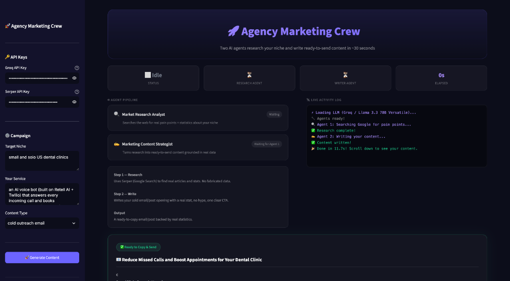
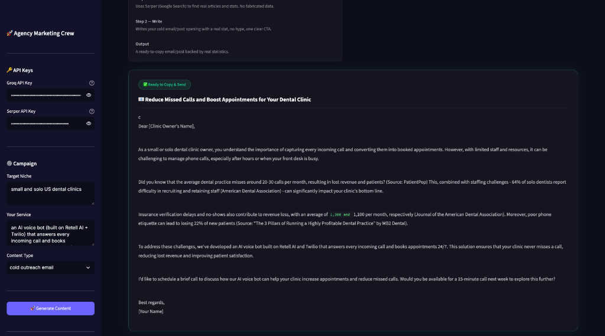

# 🚀 Agency Marketing Crew

A two-agent AI system that turns any target niche into ready-to-send marketing content in under 30 seconds.

Built with [CrewAI](https://crewai.com), [Groq](https://console.groq.com), and [Serper](https://serper.dev).

---

## 📸 Screenshots

| Web Interface | Generated Output |
|---|---|
|  |  |

---

## 🧠 How It Works

Two AI agents run sequentially — the second one automatically receives the first one's output:

```
┌─────────────────────────────────────────┐
│  Agent 1 — Market Research Analyst      │
│                                         │
│  Searches Google (via Serper API) for:  │
│  • Real pain points of the niche        │
│  • Concrete statistics with sources     │
└────────────────────┬────────────────────┘
                     │ passes research to ↓
┌────────────────────▼────────────────────┐
│  Agent 2 — Marketing Content Strategist │
│                                         │
│  Uses the research to write:            │
│  • Cold outreach email                  │
│  • LinkedIn post                        │
│  • Twitter thread                       │
│  • Instagram caption                    │
└─────────────────────────────────────────┘
```

**Output:** A ready-to-copy email or post — grounded in real statistics, no hype language, one clear call to action.

---

## 🛠️ Tech Stack

| Technology | Role |
|---|---|
| [CrewAI](https://crewai.com) | Multi-agent orchestration framework |
| [Groq](https://console.groq.com) | LLM inference (Llama 3.3 70B — free tier) |
| [Serper](https://serper.dev) | Google Search API for Agent 1's research |
| [Streamlit](https://streamlit.io) | Web interface |
| Python 3.11 | Runtime |

---

## ⚡ Quickstart

### 1. Clone the repo
```bash
git clone https://github.com/ahad_akhtrr/agency-marketing-crew.git
cd agency-marketing-crew
```

### 2. Create virtual environment
```bash
python -m venv venv
source venv/bin/activate        # Windows: venv\Scripts\activate
```

### 3. Install dependencies
```bash
pip install -r requirements.txt
```

### 4. Set up API keys

Copy the example env file and fill in your keys:
```bash
cp .env.example .env
```

Open `.env` and add:
```
GROQ_API_KEY=gsk_...        # free at console.groq.com
SERPER_API_KEY=abc123...    # free at serper.dev
```

### 5. Run

**Web interface (recommended):**
```bash
streamlit run app.py
```
Then open [http://localhost:8501](http://localhost:8501)

**Terminal:**
```bash
python agency_marketing_crew.py
```

---

## 🎯 Customising the Campaign

Edit the `inputs` dict at the bottom of `agency_marketing_crew.py` (or use the web UI sidebar):

```python
inputs = {
    # Who you're targeting
    "niche": "solo US law firms with 1-5 attorneys",

    # What you're selling
    "our_service": "an AI intake bot that qualifies leads and books consultations 24/7",

    # Output format: cold outreach email | LinkedIn post | Twitter thread | Instagram caption
    "content_type": "LinkedIn post",
}
```

---

## 📁 Project Structure

```
agency-marketing-crew/
│
├── agency_marketing_crew.py   # Core crew logic (agents, tasks, crew)
├── app.py                     # Streamlit web interface
├── requirements.txt           # Python dependencies
│
├── .env.example               # Template — copy to .env and add your keys
├── .env                       # Your actual keys — NOT committed to git
├── .gitignore                 # Excludes .env and venv
│
├── .streamlit/
│   └── config.toml            # Streamlit dark theme configuration
│
└── assets/
    └── screenshots/           # UI screenshots for this README
```

---

## 🔑 Getting Free API Keys

| Key | Where to get it | Free tier |
|---|---|---|
| `GROQ_API_KEY` | [console.groq.com](https://console.groq.com) → API Keys | 14,400 req/day — no card needed |
| `SERPER_API_KEY` | [serper.dev](https://serper.dev) | 2,500 searches free — no card needed |

---

## 🔒 Security

- `.env` is listed in `.gitignore` and will **never** be committed
- API keys entered in the Streamlit sidebar are not stored anywhere
- See `.env.example` for the required key names

---

## 📄 License

MIT — free to use, modify, and distribute.
